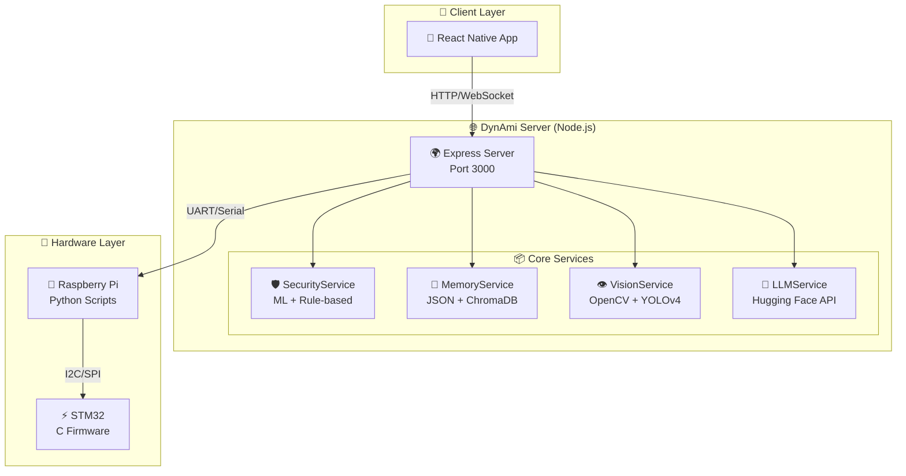
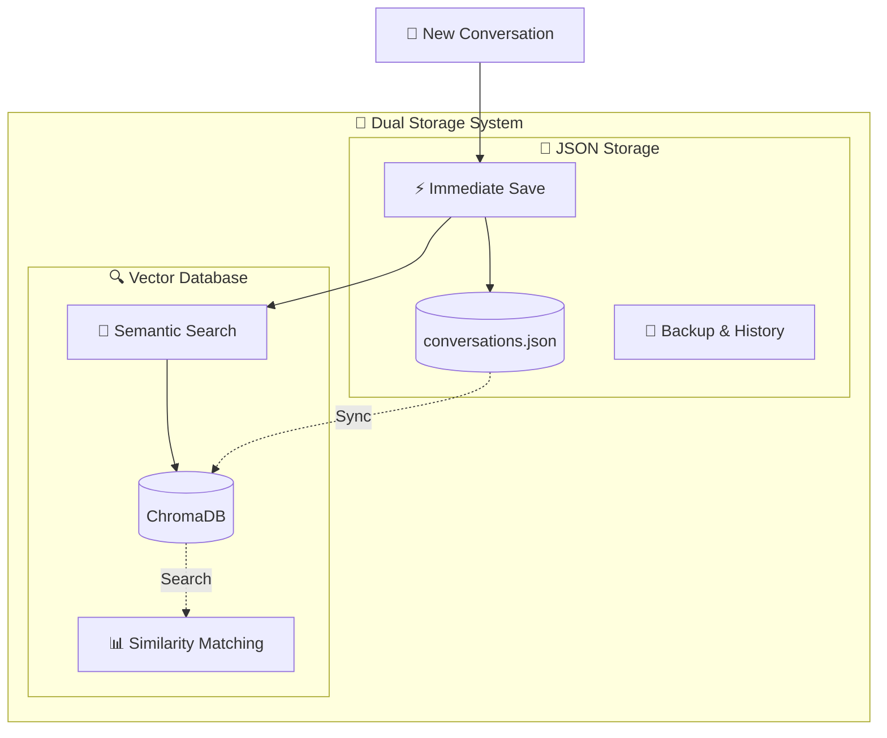

# 🏗️ DynAmi Robot - Architectures Essentielles

---

## 1. 🌐 Architecture Serveur

### Vue d'ensemble du système



---

## 2. 🔍 Architecture RAG

### Pipeline de traitement d'une requête

```mermaid
flowchart LR
    INPUT[📝 User Query<br/>"Hello, how are you?"]

    subgraph "🔍 Retrieval Phase"
        EMBED[🧠 Text Embedding<br/>Vector Conversion]
        SEARCH[🔍 Semantic Search<br/>ChromaDB Query]
        RESULTS[📊 Top 3 Results<br/>Relevant Conversations]
    end

    subgraph "📋 Context Assembly"
        CONTEXT[📝 Context Building]
        PREFS[⚙️ User Preferences]
        VISION[👁️ Vision Context]
        EMOTION[😊 Emotion Analysis]
    end

    subgraph "🤖 Generation Phase"
        PROMPT[📄 Enhanced Prompt<br/>System + Context + Query]
        LLM[🤖 LLM Call<br/>Hugging Face API]
        RESPONSE[✅ Generated Response]
    end

    subgraph "💾 Storage Phase"
        STORE_JSON[📄 JSON Storage<br/>conversations.json]
        STORE_VECTOR[🔍 Vector Storage<br/>ChromaDB]
        UPDATE[🔄 Update Embeddings]
    end

    INPUT --> EMBED
    EMBED --> SEARCH
    SEARCH --> RESULTS

    RESULTS --> CONTEXT
    PREFS --> CONTEXT
    VISION --> CONTEXT
    EMOTION --> CONTEXT

    CONTEXT --> PROMPT
    PROMPT --> LLM
    LLM --> RESPONSE

    RESPONSE --> STORE_JSON
    RESPONSE --> STORE_VECTOR
    STORE_VECTOR --> UPDATE
```

### Système de stockage dual


