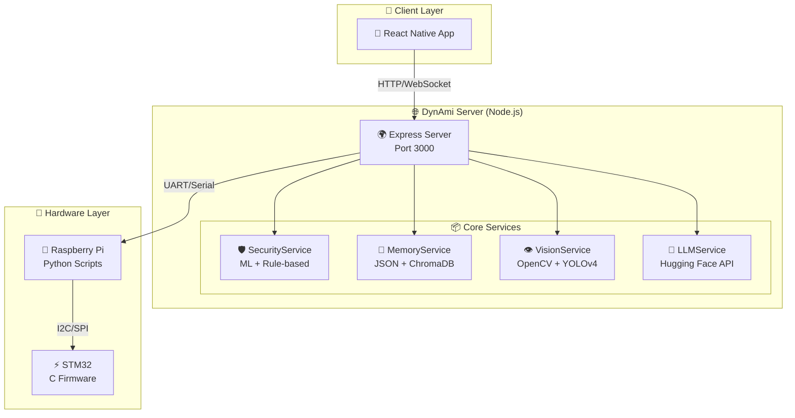
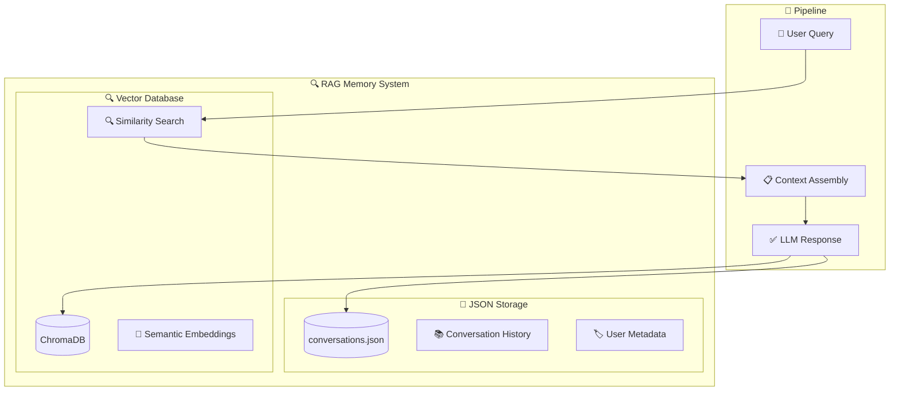

# 🏗️ DynAmi Robot - Architectures Essentielles

---

## 1. 🌐 Architecture Serveur

### Vue d'ensemble du système

```mermaid
graph TB
    subgraph "🌐 DynAmi Server (Node.js)"
        HTTP[🌍 Express Server<br/>Port 3000]

        subgraph "📦 Core Services"
            SEC[🛡️ SecurityService<br/>ML + Rule-based]
            MEM[💾 MemoryService<br/>JSON + ChromaDB]
            VIS[👁️ VisionService<br/>OpenCV + YOLOv4]
            LLM[🤖 LLMService<br/>Hugging Face API]
        end
    end

    subgraph "📱 Client Layer"
        APP[📱 React Native App]
    end

    subgraph "🔧 Hardware Layer"
        RPI[🍓 Raspberry Pi<br/>Python Scripts]
        STM[⚡ STM32<br/>C Firmware]
    end

    APP -->|HTTP/WebSocket| HTTP
    HTTP --> SEC
    HTTP --> MEM
    HTTP --> VIS
    HTTP --> LLM
    HTTP -->|UART/Serial| RPI
    RPI -->|I2C/SPI| STM
```

---

## 2. 🔍 Architecture RAG

### Système de stockage dual

```mermaid
graph TB
    subgraph "🔍 RAG Memory System"
        subgraph "📄 JSON Storage"
            JSON[(conversations.json)]
            HIST[📚 Conversation History]
            META[🏷️ User Metadata]
        end

        subgraph "🔍 Vector Database"
            CHROMA[(ChromaDB)]
            EMBED[🧠 Semantic Embeddings]
            SEARCH[🔍 Similarity Search]
        end
    end

    subgraph "🔄 Pipeline"
        QUERY[📝 User Query]
        CONTEXT[📋 Context Assembly]
        RESPONSE[✅ LLM Response]
    end

    QUERY --> SEARCH
    SEARCH --> CONTEXT
    CONTEXT --> RESPONSE
    RESPONSE --> JSON
    RESPONSE --> CHROMA
```
