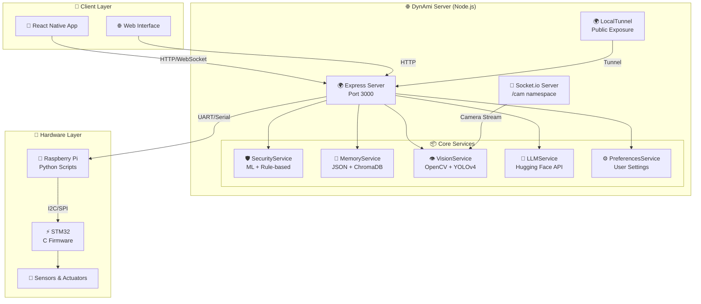
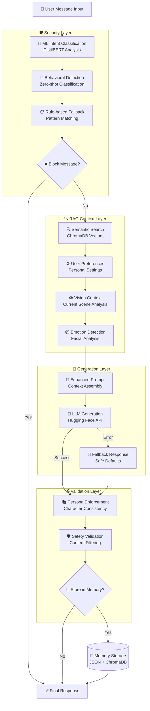
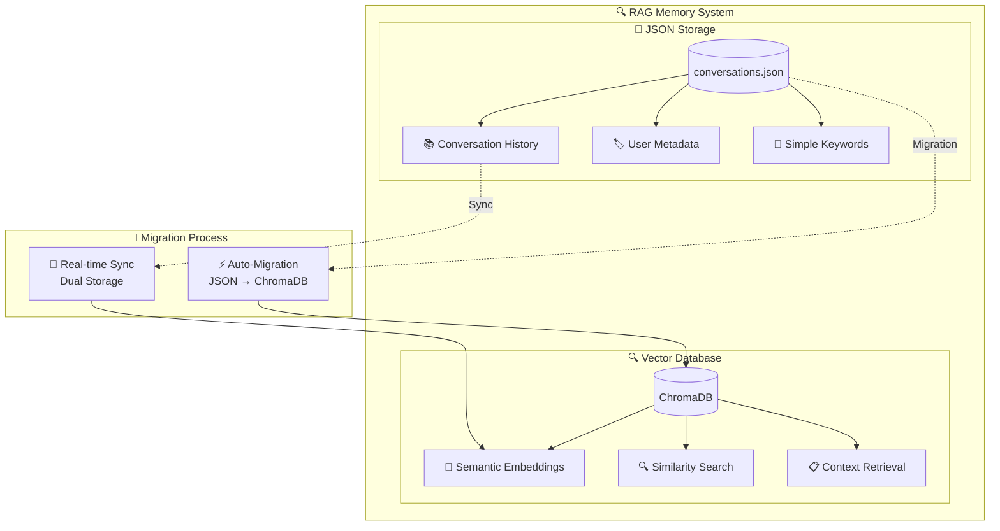
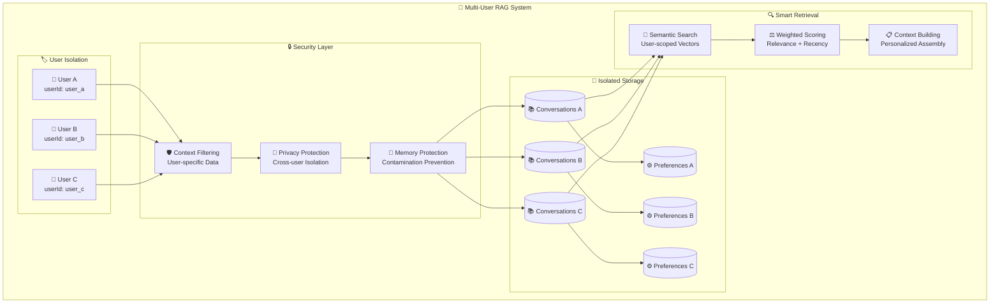
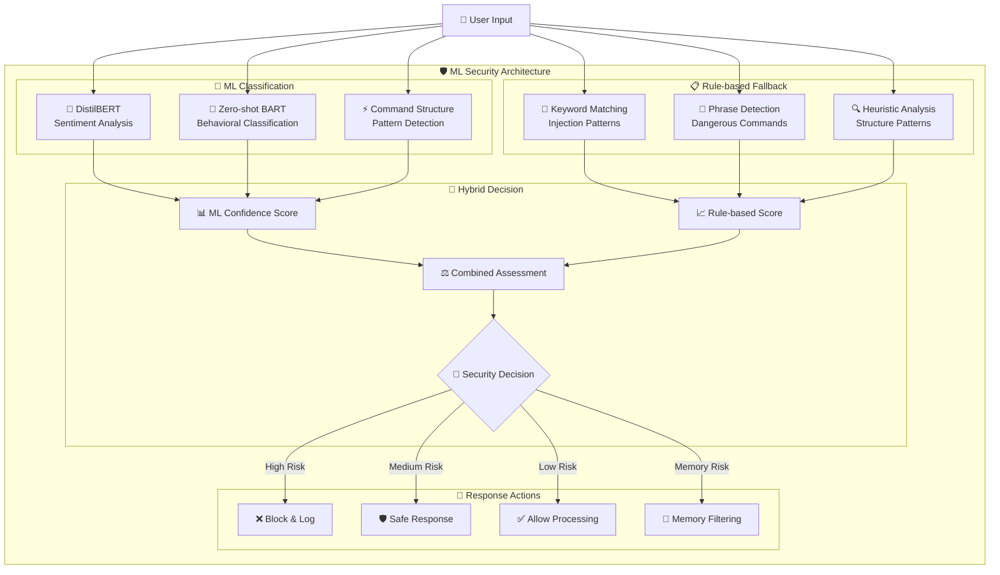
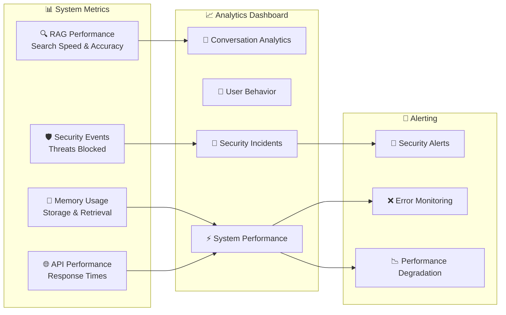

# 🏗️ DynAmi Robot - Architecture Documentation

Ce document présente les architectures techniques essentielles du projet DynAmi, un robot compagnon intelligent avec capacités d'IA conversationnelle et de sécurité avancée.

---

## 1. 🌐 Architecture Serveur

### Vue d'ensemble du système
Le serveur DynAmi utilise une architecture modulaire avec des services spécialisés pour chaque fonctionnalité.



### Pipeline de traitement des messages



---

## 2. 🔍 Architecture RAG (Retrieval-Augmented Generation)

### Système de stockage dual
Le système RAG utilise un stockage hybride pour optimiser les performances et la recherche sémantique.



### Pipeline RAG détaillé

```mermaid
flowchart TD
    QUERY[📝 User Query]

    subgraph "🔍 Search Process"
        CLEAN[🧹 Text Preprocessing<br/>Cleaning & Normalization]
        EMBED_GEN[🧠 Embedding Generation<br/>Vector Conversion]
        SIMILARITY[📊 Similarity Search<br/>ChromaDB Query]
        RANK[📈 Result Ranking<br/>Relevance Scoring]
    end

    subgraph "📋 Context Assembly"
        CONV[💬 Top Conversations<br/>Most Relevant (3)]
        USER_PREF[👤 User Preferences<br/>Personal Settings]
        VIS_CTX[👁️ Vision Context<br/>Current Scene]
        EMO_CTX[😊 Emotion Context<br/>Facial Analysis]
        BASELINE[🎭 Persona Baseline<br/>Robot Character]
    end

    subgraph "🤖 Prompt Construction"
        SYS_PROMPT[🎭 System Prompt<br/>Robot Personality]
        CTX_INJECT[📝 Context Injection<br/>Retrieved Information]
        USER_MSG[💬 User Message<br/>Current Query]
        GUIDELINES[📋 Response Guidelines<br/>Behavior Rules]
        FINAL_PROMPT[📄 Enhanced Prompt<br/>Complete Context]
    end

    subgraph "💾 Memory Update"
        STORE_JSON[📄 JSON Storage<br/>Immediate Save]
        STORE_VECTOR[🔍 Vector Storage<br/>ChromaDB Add]
        UPDATE_PREF[⚙️ Update Preferences<br/>Learning Loop]
    end

    RESPONSE[✅ LLM Response]

    QUERY --> CLEAN
    CLEAN --> EMBED_GEN
    EMBED_GEN --> SIMILARITY
    SIMILARITY --> RANK

    RANK --> CONV
    RANK --> USER_PREF
    RANK --> VIS_CTX
    RANK --> EMO_CTX
    RANK --> BASELINE

    CONV --> SYS_PROMPT
    USER_PREF --> CTX_INJECT
    VIS_CTX --> CTX_INJECT
    EMO_CTX --> CTX_INJECT
    BASELINE --> SYS_PROMPT

    SYS_PROMPT --> USER_MSG
    CTX_INJECT --> USER_MSG
    USER_MSG --> GUIDELINES
    GUIDELINES --> FINAL_PROMPT

    FINAL_PROMPT --> RESPONSE

    RESPONSE --> STORE_JSON
    RESPONSE --> STORE_VECTOR
    RESPONSE --> UPDATE_PREF
```

### Isolation utilisateur et sécurité



---

## 🛡️ Sécurité ML Intégrée

### Architecture de sécurité hybride



---

## 📈 Métriques et Monitoring

### Système de monitoring intégré



Cette architecture modulaire permet à DynAmi de maintenir des conversations contextuelles et sécurisées tout en restant performant et extensible.