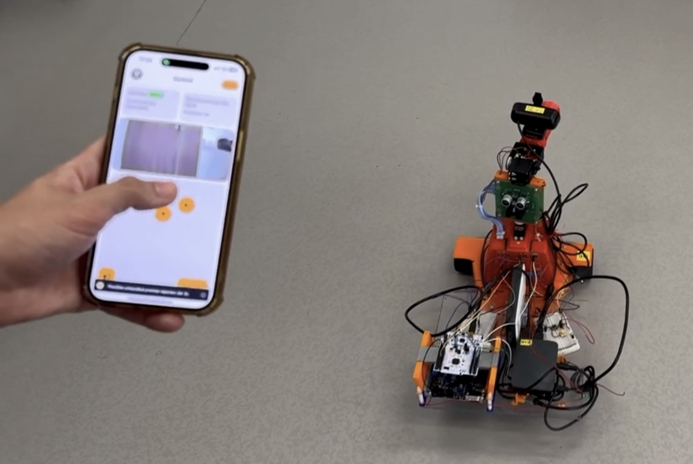
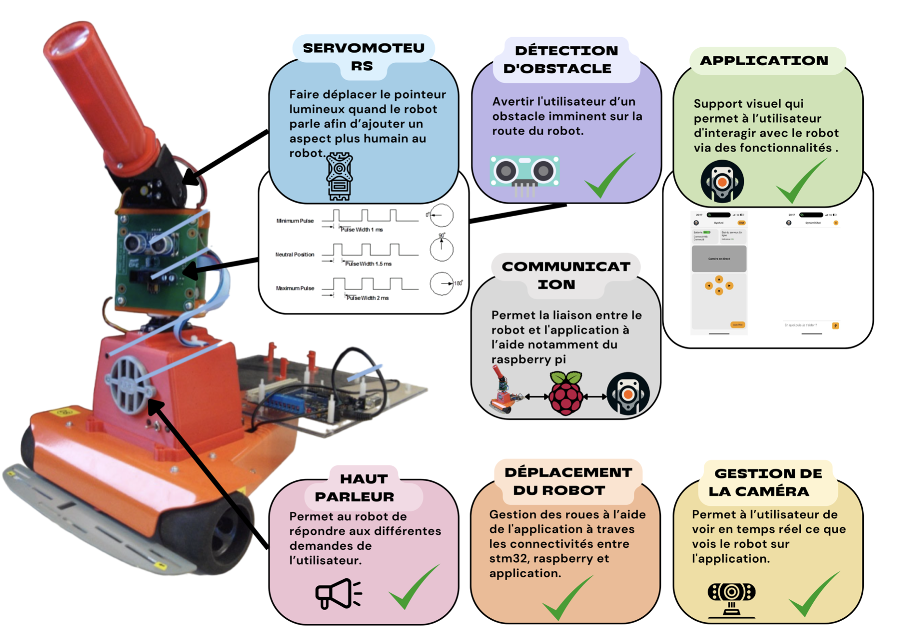
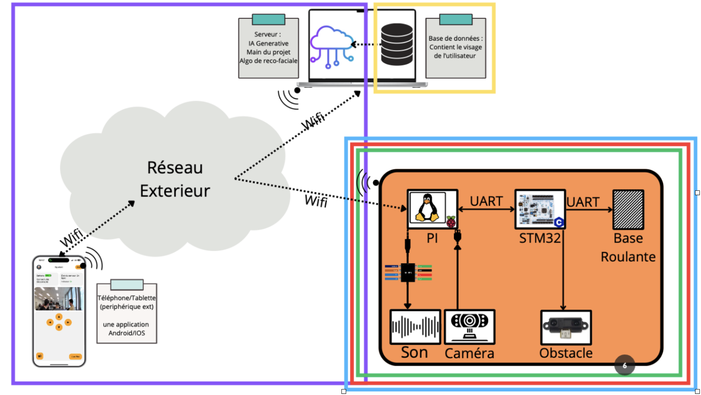
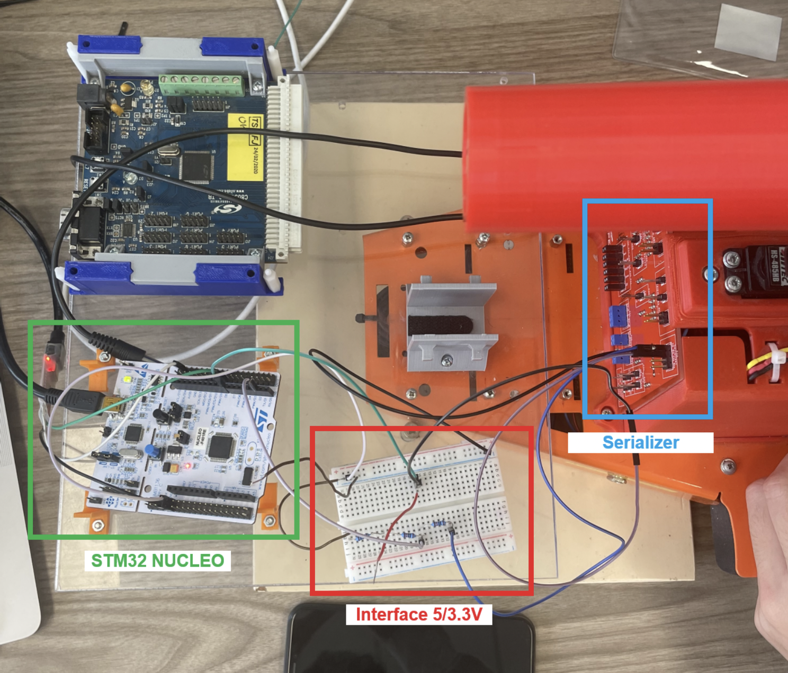
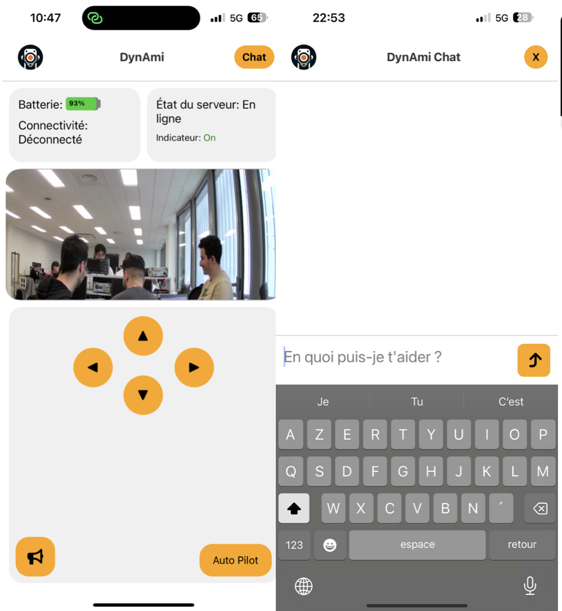

<h1 align="center">🤖 DynAmi – Your AI-Powered Companion Robot</h1>

  

  <b>Autonomous • Interactive • AI-Powered</b> 
  DynAmi is a smart companion robot that can see, hear, talk, and interact naturally with humans.

  
  
  

---

## 🎥 Demo

  

<i>▶️ Click the thumbnail to watch DynAmi in action!</i>

---

## ✨ Key Features
✅ **Autonomous Navigation** – IR sensors & ultrasonic modules for obstacle detection and safe movement  
✅ **Bidirectional Communication** – Mobile app ↔ Node.js server ↔ Raspberry Pi ↔ STM32 robot  
✅ **AI-Powered Chat** – Real-time voice commands & responses with GPT-powered chatbot  
✅ **Facial Recognition & Emotion Detection** – Using OpenCV, DeepFace & face_recognition  
✅ **Individual Detection & Tracking** – YOLOv4-based tracking system  
✅ **Interactive Mobile App** – Control the robot, chat with AI, get real-time alerts  
✅ **Audio Output** – High-quality sound via LM4871 amplifier  

---

## 🌟 Overall Functionalities

  

DynAmi integrates **vision, speech, and autonomous navigation** into a unified platform.  
The system is built around **three main components**:

1. **Mobile App (React-Native)** – Provides user interface, controls, and chat.  
2. **Server (Node.js)** – Acts as a bridge between the app, AI services, and the robot.  
3. **Robot (Raspberry Pi + STM32)** – Executes movements, speech, and AI-based recognition.

---

## 🛠 Tech Stack

### 🔗 Software
| Category           | Technologies |
|--------------------|--------------|
| 🌐 **Frontend**    |  React-Native · HTML · CSS |
| ⚙️ **Backend**     |  Node.js · Express.js |
| 🐍 **Python**      |  OpenCV · DeepFace · face_recognition · SpeechRecognition · gTTS |
| 🤖 **AI Models**   | YOLOv4 · GPT-4 API |
| 🔌 **Communication** | UART · Socket.io · LocalTunnel |

### 🔩 Hardware
| Component              | Icon |
|------------------------|------|
| 🖥️ Raspberry Pi 3B     |  |
| 🔬 STM32 Nucleo        |  |
| 🔊 LM4871 Speaker      | 🎵 |
| 🎥 USB Webcam          | 📷 |
| ⚙️ DC Motors           | ⚙️ |
| 📡 IR & Ultrasonic Sensors | 📡 |

---

## 📸 System Overview

### Architecture

  

### Wiring Diagram

  

---

## 📱 Mobile App

  

