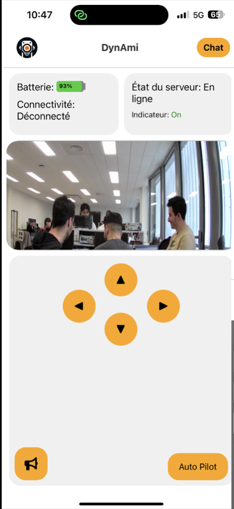
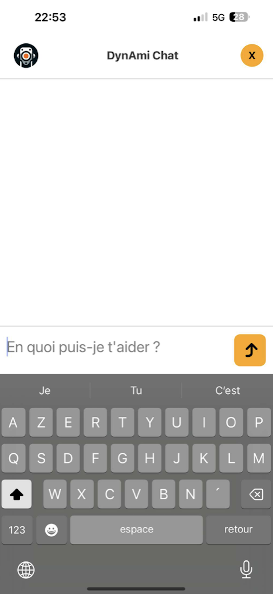

<h1 align="center">🤖 DynAmi – Your AI-Powered Companion Robot</h1>

  

  <b> AI-Powered • Interactive </b> 
  DynAmi is a smart companion robot that can see, hear, talk, and interact naturally with humans and environement .

  
  
  

---

## 🎯 Project Goals

DynAmi was built as an **interactive companion robot** combining robotics, AI, and a mobile interface to create a personalized and immersive user experience.

### 🔑 Core Objectives
✨ **Interactive Communication** – Build a system that lets users control the robot and receive real-time responses via **voice chat, transcription, and GPT-powered AI**.  

✨ **Intelligent Perception** – Integrate **facial recognition, emotion detection, and individual tracking**, enabling the robot to recognize users and adapt its interactions.  

✨ **Seamless Connectivity** – Develop a **robust architecture** connecting the mobile app, server, Raspberry Pi, and STM32 for smooth bidirectional communication.  

✨ **User-Friendly Control** – Provide a **React-Native mobile app** to manage movements, monitor status, and interact naturally with the robot.  

---

## 🎥 Demo

  

<i>▶️ Click the thumbnail to watch DynAmi in action on YouTube!</i>

---

## ✨ Key Features
✅ **Autonomous Navigation** – IR sensors & ultrasonic modules for obstacle detection and safe movement  
✅ **Bidirectional Communication** – Mobile app ↔ Node.js server ↔ Raspberry Pi ↔ STM32 robot  
✅ **AI-Powered Chat** – Real-time voice commands & responses with GPT-powered chatbot  
✅ **Facial Recognition & Emotion Detection** – Using OpenCV, DeepFace & face_recognition  
✅ **Individual Detection & Tracking** – YOLOv4-based tracking system  
✅ **Interactive Mobile App** – Control the robot, chat with AI, get real-time alerts  
✅ **Audio Output** – High-quality sound via LM4871 amplifier  

  

---

## 🛠 Tech Stack

### 🔗 Software
| Category           | Technologies |
|--------------------|--------------|
| 🌐 **Frontend**    |  React-Native · HTML · CSS |
| ⚙️ **Backend**     |  Node.js · Express.js |
| 🐍 **Python**      |  OpenCV · DeepFace · face_recognition · SpeechRecognition · gTTS |
| 🤖 **AI Models**   | YOLOv4 · GPT-4 API |
| 🔌 **Communication** | UART · Socket.io · LocalTunnel |

### 🔩 Hardware

| Component           | Description                              |
|---------------------|------------------------------------------|
| Raspberry Pi 3B     | Main processing unit for high-level tasks |
| STM32 Nucleo        | Microcontroller for low-level control    |
| LM4871 Speaker      | Amplified audio output                   |
| USB Webcam          | Camera for face and object recognition   |
| DC Motors           | Robot movement and locomotion           |
| IR & Ultrasonic Sensors | Obstacle detection and distance measurement |
| Servomotors         | Camera orientation and light pointing    |

---

## 📸 System Overview

### Architecture

  

### Wiring Diagram

  

---

## 📱 Mobile App

  
  

